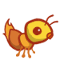
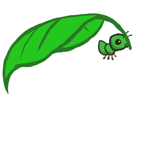

# Ants vs. Bees

It is a game consisting of series of turns. In each turn, new bees may enter the ant colony. Then, new ants are placed to defend their colony. Finally, all insects (ants, then bees) take individual actions. Bees either try to move toward the end of the tunnel or sting ants in their way. Ants perform a different action depending on their type, such as collecting more food, or throwing leaves at the bees. The game ends either when a bee reaches the ant queen, or the entire bee fleet has been vanquished.

# Code in Action

The following shows the game play in its fully implemented state:

# Implemented Characters

This section depicts which characters have been implemented for this game.

### Harverster Ant

Deploying ants cost food. A harverster's responsibility is to add food to the colony.

### Thrower Ant

Its job is to attack the nearest bee in front of it.

### Short-Thrower Ant

Can only attack the bees that are within 3 distance away from it.

### Long-Thrower Ant

Can attack the bees that are beyond 4 distance away from it.

### Fire Ant

Whenever it receives damage, it reflects the damage back.

### Hungary Ant

Devours any bee that is in its place.

### Ninja Ant

Damages all bees that pass by, and it cannot be stung by any bee.

### Wall Ant

It is useful because of its armor.

### Bodyguard Ant

Its job is to protect any other ant.

### Tank Ant

Protects an ant in its place, and also damages bees in the same place.

### Scuba-Thrower Ant

Is able to attack bees in water.

### Queen Ant

Doubles the damages of other ants that are behind it. There could be only one true queen; and others placed on the map are just illusions.

### Laser Ant

Damages all bees or ants that are in front of it.

